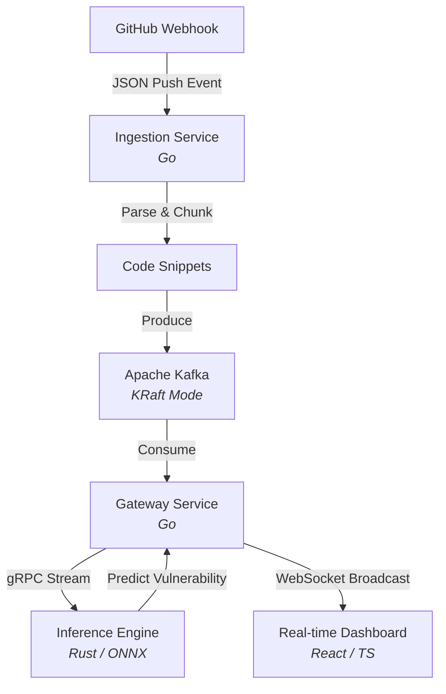

<div align="center">
  <h1>🚀 Code Anomaly Engine</h1>
  <p><strong>Real-time AI-powered vulnerability detection for high-velocity codebases.</strong></p>

  [](https://go.dev/)
  [](https://www.rust-lang.org/)
  [](https://kafka.apache.org/)
  [](https://reactjs.org/)
  [](https://onnxruntime.ai/)
</div>

---

## 📌 Overview

**Code Anomaly Engine** is a polyglot, event-driven microservice architecture designed to intercept GitHub push events in real-time, extract code diffs, and classify them for security vulnerabilities using a fine-tuned CodeBERT transformer model. 

It is engineered to handle high-throughput development environments, providing sub-millisecond inference latency and real-time WebSocket updates to a centralized monitoring dashboard.

## 🏗 Architecture

The system leverages an event-driven design decoupled via **Apache Kafka**, allowing components to scale independently.



### Components

1. **Ingestion Service (Go):** Receives GitHub webhook payloads, parses git diffs to extract added/modified code chunks, and publishes structured messages to Kafka.
2. **Kafka Event Bus:** Decouples ingestion from inference, absorbing sudden traffic spikes during CI/CD surges.
3. **Gateway Service (Go):** Consumes Kafka messages, acts as a gRPC client to request predictions from the ML backend, and broadcasts results to connected UI clients via WebSockets.
4. **Inference Engine (Rust):** A high-performance gRPC server utilizing `ort` (ONNX Runtime) for ultra-fast, sub-50ms ML inference on a CodeBERT sequence classification model.
5. **Dashboard (React/TypeScript):** Connects to the Gateway via WebSockets to provide a live, real-time feed of code anomalies with syntax-highlighted diffs and latency metrics.
6. **ML Pipeline (Python):** Downloads the Devign vulnerability dataset, fine-tunes Microsoft's `CodeBERT`, and exports the computational graph to an ONNX format with dynamic sequence lengths.

## 🚀 Quick Start

The entire system is containerized. To spin up the Kafka broker, microservices, and dashboard:

```bash
docker-compose up --build -d
```

### Services Map

| Service | Port | Description |
|---|---|---|
| **Dashboard** | `http://localhost:5173` | Real-time React frontend |
| **Ingestion** | `http://localhost:8080/webhook` | GitHub webhook receiver |
| **Gateway** | `http://localhost:8081/ws` | WebSocket endpoint for UI |
| **Inference** | `grpc://localhost:50051` | Rust ONNX gRPC Backend |
| **Kafka** | `localhost:9092` | Internal event broker |

## 🧠 Machine Learning

The anomaly detection model is based on [Microsoft's CodeBERT](https://huggingface.co/microsoft/codebert-base) fine-tuned on the [Devign Dataset](https://arxiv.org/abs/1909.03496) (27k vulnerable and clean C/C++ functions).

To recreate the model locally:
```bash
make train   # Downloads dataset, tokenizes, and fine-tunes CodeBERT
make export  # Exports the PyTorch model to ONNX with dynamic axes
```

## 🛠 Tech Stack Deep Dive

- **Go (1.22):** Used for IO-bound microservices (Ingestion, Gateway). Leverages goroutines for concurrent webhook processing and Kafka consumption.
- **Rust (1.77):** Used for CPU-bound ML inference. `tonic` for async gRPC and `ort` for highly optimized C++ backend ONNX inference.
- **Kafka (KRaft):** Used without Zookeeper for simplified infrastructure. Provides fault tolerance and buffering.
- **gRPC / Protobuf:** Enables strict-schema, low-overhead binary communication between the Go Gateway and Rust Inference Engine.
- **React + Recharts:** Provides dynamic, real-time metrics (p99 latency) and live UI updates without polling.
